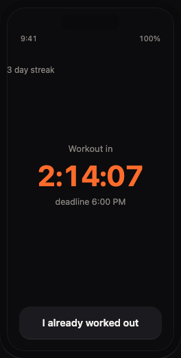
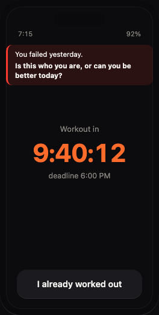
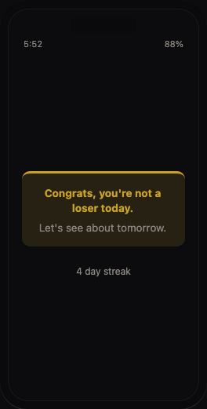
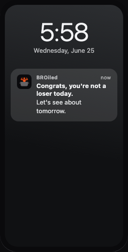
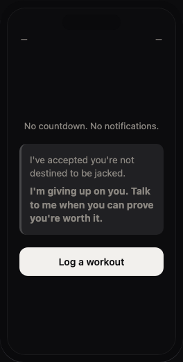
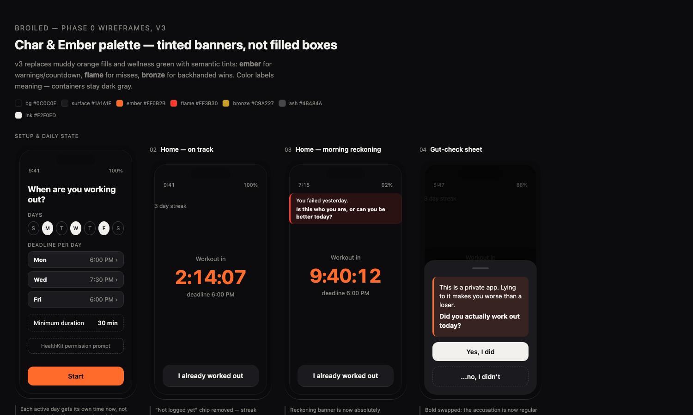

# BROiled

**BROke streak? You're cooked.**

BROiled is an iOS workout accountability app with tough-love energy. Set a per-day workout deadline, and if Apple Health doesn't show a qualifying workout in time, you get roasted — escalating snoozes, morning reckonings, and eventually silence if you keep skipping.

> *Marketing:* Broke your workout streak? You're cooked.


## Status

**Phase 0 — design & planning.** Interactive wireframes and product spec live in this repo; the SwiftUI app is not built yet.

## How it works

1. **Onboarding** — pick workout days, set a **deadline per day**, and choose a minimum duration.
2. **Countdown** — home screen shows time left until today's deadline (HealthKit-verified).
3. **Miss the window** — notifications escalate (MILD → SPICY → NUCLEAR). Snooze pushes the deadline back.
4. **Morning reckoning** — after a miss, next open starts with yesterday's failure + today's countdown.
5. **Success** — backhanded celebration (bronze, not cheerleader green).
6. **Silence** — after 7 consecutive misses, the app stops nagging until you log a workout again.

Open [`wireframes.html`](wireframes.html) in a browser for all 11 Phase 0 screens with design notes.

## Screenshots

### Countdown (on track)



### Morning reckoning



### Snooze sheet


### Backhanded success



### Lock screen notification



### 7-day silence



### Full wireframe rail



## Design

**Char & Ember** palette — semantic tints, not filled alert boxes:

| Token | Hex | Use |
|-------|-----|-----|
| Ember | `#FF6B2B` | Countdown, primary CTAs |
| Flame | `#FF3B30` | Miss reckoning, destructive actions |
| Bronze | `#C9A227` | Backhanded success (never wellness green) |
| Ash | `#48484A` | Silence / give-up state |
| Background | `#0C0C0E` | App shell |

## Repo contents

| File | Description |
|------|-------------|
| [`wireframes.html`](wireframes.html) | Interactive Phase 0 wireframes (v3) |
| [`plan.md`](plan.md) | Full product & engineering plan |
| [`logo.png`](logo.png) | App icon — flexing figure over the pot |
| [`scripts/capture-screenshots.mjs`](scripts/capture-screenshots.mjs) | Regenerate README screenshots from wireframes |

Regenerate screenshots after wireframe changes:

```bash
npm install playwright
npx playwright install chromium
node scripts/capture-screenshots.mjs
```

## Stack (planned)

- SwiftUI + SwiftData (iOS 17+)
- HealthKit for workout verification
- Local notifications + background checks
- Phase 1+: persona voices, Live Activity countdown, weekly roast report

## License

TBD
