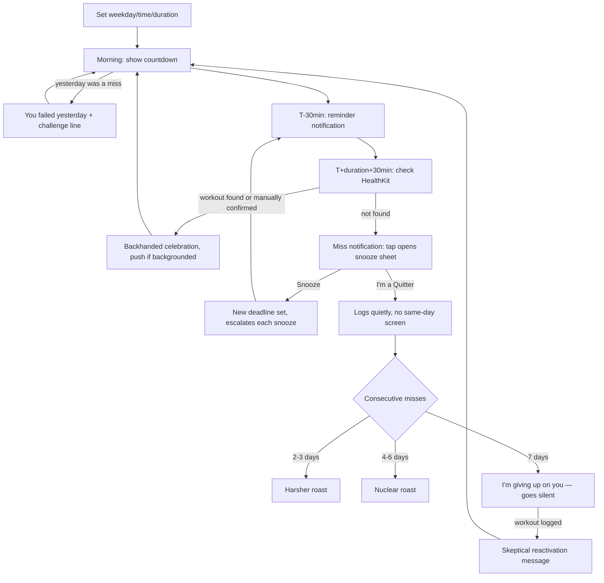

# BROiled (iOS)

## Branding (locked)

| Slot | Copy |
|------|------|
| **App name** | BROiled |
| **App Store subtitle** (≤30 chars) | `BROke streak? You're cooked.` (28 chars) |
| **Marketing tagline** | Broke your workout streak? You're cooked. |

**Pun stack:** **BRO**iled (name) + **BRO**ke (subtitle) + **cooked** (broiled/roasted payoff). "Workout" is omitted from the subtitle — v1 is workout-only, and "streak" reads clearly in a Health & Fitness context.

**Wordmark:** emphasize **BRO** in both BROiled and BROke; `iled` / streak line can be lighter or flame-toned.

**Project path:** [`/Users/quinnnguyen/Projects/broiled`](/Users/quinnnguyen/Projects/broiled)  
**Bundle ID:** `com.quinnnguyen.broiled` (adjust to your Apple Developer team prefix)

**Inclusivity note:** the name skews bro-y on first read; broaden via marketing copy, mixed screenshots, and Phase 1 persona voices that aren't all gym-bro (e.g. savage best friend, disappointed coach, nuclear bro). Tone slider at onboarding — user opts into brutality.

---

## Why this is fun (not just mean)

A shame notification by itself is just a scold — annoying, not delightful. What makes this fun to actually use is the game loop wrapped around the insults, not the insults themselves:

- **Dread → relief is the core dopamine loop.** The countdown to deadline is real stakes, like a boss timer. Log the workout and the pending shame silently clears — that's a small win you get to feel *every day you succeed*, not just punishment on the days you fail.
- **A character, not a random-insult generator.** CARROT Fit (2014, still on the App Store, 4.7★) proved this genre works for a decade on one insight: people don't get attached to "insult #47," they get attached to a personality with a consistent voice. Phase 0 ships with a static curated list; Phase 1 gives it a name and a real voice — see `phase1-persona`.
- **The silence is scarier than the noise.** The 7-day "I'm giving up on you" mechanic — the app going completely quiet until you prove yourself — is the sharpest hook in this design. Most apps nag harder when ignored; this one does the opposite, and making the user *earn back* the app's attention is a stronger emotional beat than any single insult.
- **Backhanded celebration closes the loop.** Success isn't met with silence or a green checkmark, it's met with grudging, sarcastic approval ("Congrats, you're not a loser today"). That's what makes the whole thing feel like a relationship with a character instead of a checklist.
- **Design for screenshots eventually.** Not in Phase 0, but the weekly report and Hall of Shame (Phase 1/2) should be built to be shared — that's the real growth channel for a niche comedy app, not App Store search.

## The core motivation

There's a mentality people describe as having "a bit of dog in you" — the extra gear that shows up when something's actually on the line, the refusal to take a soft no from yourself. Most people don't have easy access to that gear on a random Tuesday when the only thing at stake is whether they go to the gym. This app manufactures that gear on demand — it's the stand-in for stakes that aren't naturally there.

And underneath that: at some point you move out, and the one voice that never once said "good enough" goes quiet. Nobody's tracking your effort against your potential anymore. Nobody's unimpressed on your behalf. This app is built to be that voice again, on purpose — the parent who steps back in for the one thing you keep meaning to actually stick to, because you're the one who asked it to.

It's not therapy and it doesn't pretend to be encouraging. It's a rival and a disappointed relative who happen to live in your lock screen, and the entire game is proving them wrong.

---

## Build phases

| Phase | Scope |
|-------|-------|
| **Phase 0 (true MVP — build this first)** | One habit ("Workout"), manual weekday × time × duration setup, HealthKit deadline check + manual fallback, uncapped escalating snooze, morning reckoning message, backhanded celebration, miss-streak ladder + silence/reactivation mechanic, static ~40-line insult list. No persona system, no Live Activity, no auto-schedule, no weekly report, no AI photo. |
| **Phase 1** | Named persona + voice (`Insults.json` namespaced by persona × intensity), polished full-screen roast UI, Live Activity/Dynamic Island countdown (real ActivityKit work — needs a widget extension), auto-generated weekly schedule from a frequency goal, weekly roast report + shareable card |
| **Phase 2** | Opt-in AI "consequence photo," Hall of Shame history screen, share cards for roast moments and streak milestones, multiple persona packs |
| **Phase 3 (deferred)** | Friend shame SMS (Twilio, double opt-in), app blocking via `FamilyControls` (requires Apple entitlement approval, 2-4 week lead time — submit early if you get here) |

Phase 0 is intentionally small enough to build in days and use on your own phone before touching TestFlight. Everything that makes the app *feel* like a finished product — the persona, the countdown widget, the shareability — is Phase 1+, deliberately deferred so the core loop can be validated first.

---

## Core user loop (Phase 0)



**Notification schedule (Phase 0):**
1. **T-30min before deadline** — reminder push ("30 minutes left today.") so the deadline doesn't arrive as a surprise. Tapping opens the snooze sheet directly, since that's the only decision left to make at that point.
2. **T + workout duration + 30min after deadline** — this is the actual miss check, not the deadline itself, since HealthKit needs time for a just-started workout to land even if the user heads out right at the deadline. If nothing's found, fires "You haven't worked out. Will you later?" and tapping opens the snooze sheet. Copy scales with streak — neutral on a clean history, pulling from the escalation ladder on a multi-day streak.
3. **On success** — if HealthKit picks up the workout while the app is backgrounded, the backhanded-celebration line fires as a push. If the user is already in-app and taps "I already worked out," it just shows inline (no notification needed, they're already looking at it).

**Snooze contract:** uncapped, not a fixed 2/day limit. The snooze sheet itself doesn't show an insult — the mini-insult arrives later, in the next miss-check notification (see schedule above), and escalates per snooze count that day: **snooze 1 → MILD pool, snoozes 2–3 → SPICY pool, snooze 4+ → NUCLEAR pool**, cycling once exhausted. Snoozing re-arms the T-30min/T+duration+30min notification pair against the new deadline.

**Morning reckoning, not same-day failure:** if yesterday's deadline was missed (i.e., "I'm a Quitter" was tapped, or the day ran out with no response), the *next morning's* first open leads with "You failed yesterday" + a challenge line ("Is this who you are, or can you be better today?"), then today's countdown starts underneath. No full-screen shame mid-day when the user can't do anything about it yet — the reckoning is deliberately delayed to the next morning.

**Silence mechanic:** after a 7-day miss streak, the app fires one final "I've accepted you're not destined to be jacked. I'm giving up on you. Talk to me when you can prove you're worth it." line and then **stops notifying entirely** — no countdowns, no morning messages, no reminders — until a workout is logged, which triggers a skeptical reactivation message and resumes normal operation.

---

## Verification model

Default to reading HealthKit, with a manual fallback — no geofencing, no source-filtering games. If people self-report a workout that didn't happen, they're only lying to themselves; Strava allows manual entries for the same reason, and the psychological pressure in this app comes from the escalation/silence design, not from surveillance rigor.

- **Primary:** query HealthKit for a workout meeting `minDuration` on the current day. This covers Apple Watch, Garmin (via Garmin Connect's Health sync), Strava, Peloton, gym equipment with Bluetooth, or anything else that writes an `HKWorkout` — no device requirement, no app-specific integration needed.
- **Fallback:** if nothing's found by the deadline, a manual "I already worked out" button in-app satisfies the day — but tapping it surfaces one gut-check before it counts: *"This is a private app. Lying to it makes you worse than a loser. Did you actually work out today?"* with **"Yes, I did"** / **"...no, I didn't"**. This isn't a real gate (there's no way to verify a manual claim regardless), it's a beat that makes the user say the lie out loud to themselves if they're going to tell it — which fits the theme better than pretending the button is bulletproof. "Yes, I did" logs success normally; "...no, I didn't" just returns to the countdown, nothing logged.

This also fixes a real market-sizing risk: requiring an Apple Watch specifically would exclude most of the target audience (only ~50% of US adults own any tracker, and Watch-specific figures are murkier), and the people who most need this app are disproportionately *less* likely to already have a disciplined tracking habit. Defaulting to HealthKit-with-fallback keeps the addressable market at "anyone who wants to work out," not "anyone who already owns a wearable."

---

## Insult pool

Organized by device/category with severity tags (MILD / SPICY / NUCLEAR) so Phase 0's snooze escalation and Phase 1's persona pools can both draw from the same tagged content.

**Patronizing resignation**
- "It's okay to be soft. Not everyone was built to be looked at twice." — SPICY
- "You don't have to be impressive. Someone has to be the friend people compare themselves to and feel better." — SPICY
- "It's fine, really. Someone has to be the 'before' picture." — MILD
- "Not everyone gets to be the catch. The only catch here is that you didn't work out today." — SPICY
- "Not everyone can be the top 20%. You've proved you're the bottom 20%." — SPICY
- "It's okay if the mirror isn't your friend right now. It's not lying to you, it's just tired of your excuses." — NUCLEAR

**Public perception**
- "Somewhere a stranger just walked past you, quietly grateful they're not you." — SPICY
- "You wanted people to look at you. Congrats, now they look at you with disgust." — NUCLEAR
- "Hot summer bod? More like not summer bod. Stay indoors this summer because nobody wants to see you at the beach." — NUCLEAR

**Decline / aging urgency**
- "You only get older and weaker from here. Today you just chose to speed it up for free." — SPICY
- "This is the youngest and strongest you will ever be again. You spent it on the couch." — SPICY
- "Every day you skip is a day closer to explaining to your knees why you waited." — MILD

**Social ranking**
- "Your friends talk about you when you're not in the group chat. This is one of those times." — SPICY
- "Even the friend who's nice to everyone had nothing nice to say about this." — SPICY

**Deadpan / "you just go" voice**
- "There's no secret. You just go. You didn't go. That's not complicated, you're just weak." — MILD
- "I don't think about it, I just go. You thought about it for an hour and still didn't." — MILD
- "It's not that deep. Get up, go. Somehow you still couldn't manage it." — MILD
- "Nobody's coming to make you go. Nobody ever will. And you're still just sitting there." — SPICY
- "You don't need to feel ready, you need to move. You did neither." — MILD

**Discipline-principle-flipped-to-insult** (paraphrased training philosophies, no real names/exact quotes — publicity-rights risk)
- "Everyone wants the body. Almost nobody wants the workout. Today you told me exactly which one you are." — SPICY
- "Real ones rest at the end. You rested at the beginning, the middle, and the end." — SPICY
- "Talent isn't required here. Effort is. You had neither today." — NUCLEAR
- "It doesn't get easier. It just gets more embarrassing that you still haven't started." — SPICY
- "You could've suffered for one hour today. Instead you get to feel like this a little longer." — SPICY
- "Discipline was supposed to set you free today. You chose the couch instead." — MILD
- "The part that actually changes you is the part you keep skipping. That's not a coincidence." — SPICY
- "Your mind told you to stop before you even started. You listened to the weakest part of yourself." — NUCLEAR
- "Everyone wants the outcome. Nobody wants the 5am part. You just proved which camp you're in." — SPICY

**Pushing through pain / injury**
- "Some people train through actual injuries. You couldn't train through mild inconvenience." — SPICY
- "There's a difference between can't and won't. You didn't even test which one this was." — MILD
- "Somebody came back stronger from a snapped Achilles. You haven't come back from a bad mood." — SPICY

**Hunger**
- "Hungry people don't need reminders. Looks like the only hunger you have is for a burger." — NUCLEAR

**Ego death / you vs. you**
- "It was never about anyone else. You still managed to lose to the only person who was supposed to matter — you, yesterday." — SPICY
- "Yesterday's version of you did nothing. Today's version matched it exactly." — MILD

**Sacrifice**
- "Everyone who got what you want gave something up for it. You gave up nothing today, and it shows." — SPICY
- "You didn't even have to sacrifice anything. You just had to show up. And you still didn't." — MILD

**Early mornings**
- "Someone else was up before the sun today, doing the thing you keep saying you'll start tomorrow." — MILD
- "The version of you that wins starts before it's convenient. You waited for convenient. It never came." — SPICY

**Adversity as fuel**
- "A bad day was supposed to be fuel. You just let it be an excuse instead." — MILD
- "Some people train harder because of a bad week. You used the bad week as the reason not to." — MILD

**Ex**
- "Your ex tells people they 'dodged a bullet.' Looks like they dodged a bus." — NUCLEAR

**Eagle / chicken**
- "Some people are eagles, some are chickens. At least chickens know what they are. You're still pretending." — NUCLEAR
- "You wanted to be the eagle in the story. You're the chicken they mention once to make the eagle look better." — NUCLEAR

Rough tier count: ~12 MILD / ~22 SPICY / ~9 NUCLEAR. Nuclear tier will repeat fairly quickly at snooze 3+ or the 7-day finale — worth writing more before ship, or leaning into repeats as part of the bit.

**Backhanded celebration (success day)**
- "Congrats, you're not a loser today. Let's see about tomorrow."
- "You did the bare minimum required to not be a disappointment. Enjoy it."
- "One day down. That's not a streak yet, that's a coincidence."
- "Fine. You showed up. Don't get used to being told that."
- "Today you were an eagle. We'll see what tomorrow's version of you is."

**Escalation ladder (consecutive misses)**
- *2–3 days:* "Two days isn't a slip anymore. That's a decision." / "This is starting to look like a personality, not a bad week."
- *4–6 days:* "At this point I'm not disappointed. I'm just not surprised." / "You had six chances and used all of them the same way."
- *7 days — finale, then goes silent:* "I've accepted you're not destined to be jacked. I'm giving up on you. Talk to me when you can prove you're worth it."
- *Reactivation:* "Oh. You're here. Let's see if that was a fluke." / "One workout doesn't undo a week of nothing. I'm watching again, though." / "You proved you can do it once. Now do it again before I actually care."

**Content note:** avoided lines that lean on real disability/illness (amputation, chemo) as a "no excuse" comparison — reads as exploiting others' hardship rather than roasting the user, cut deliberately.

---

## Data model (SwiftData) — Phase 0

```swift
@Model class Habit {
  var name: String = "Workout"
  var minDurationMinutes: Int
  var deadlinesByWeekday: [Int: DateComponents] // 1=Sun...7=Sat, each active day has its own hour/minute
}

@Model class DayLog {
  var date: Date
  var status: DayStatus // completed | missed | pending
  var verifiedByHealthKit: Bool
  var snoozeCount: Int // uncapped
  var insultShown: String?
}

@Model class UserSettings {
  var missStreak: Int
  var isAbandoned: Bool // true after 7-day miss streak, suppresses all notifications until reactivated
}
```

Phase 1 adds `Persona`/`toneLevel` to `UserSettings` and namespaces insults by persona; Phase 2 adds `selfieAssetId`/`imageApiEnabled`.

---

## Phase 0 screens

1. **Onboarding — Set your schedule** — pick active weekdays, then set a deadline time **per active day** (not one shared time), plus minimum workout duration; HealthKit permission requested once, first run only
2. **Home — Countdown (on track)** — today's countdown to deadline, manual "I already worked out" button
3. **Home — Morning reckoning** — shown first if yesterday was a miss: "You failed yesterday" + challenge line, then today's countdown
4. **Gut-check sheet** — shown on tapping "I already worked out": "Did you actually work out today?" / Yes, I did / ...no, I didn't
5. **Notification — T-30min reminder** — lock-screen banner, taps into the snooze sheet
6. **Notification — miss check** — lock-screen banner ("You haven't worked out. Will you later?"), taps into the snooze sheet
7. **Snooze sheet** — pick a new deadline time; buttons are **Snooze** / **I'm a Quitter**
8. **Notification — success** — lock-screen banner with the backhanded-celebration line, fires when HealthKit catches the workout in the background
9. **Home — Success (backhanded celebration)** — in-app version, shown when the day's workout is verified/confirmed while the app is open
10. **Home — Silence state** — after a 7-day miss streak: the finale line, no countdown, single "log a workout" action to reactivate
11. **Settings** — edit schedule (per-day times), HealthKit permission status. No data-deletion option in Phase 0 — not needed yet.

---

## Competitive landscape

Two genuinely different genres are relevant here — worth being deliberate about which one you're borrowing from and which you're avoiding.

**Comedic/insult accountability (closest ancestor):**

| App | What it does | Gap this app can exploit |
|-----|---------------|---------------------------|
| **[CARROT Fit](https://apps.apple.com/us/app/carrot-fit/id769155678)** (2014) | Sarcastic single-persona AI, manual weigh-ins + HealthKit sync, chat-bubble UI, threatens/insults/bribes | Last updated 4+ years ago, dated UI, fully manual data entry, no deadline-driven real-time escalation, no shareable content designed for social, single fixed persona, no "give up on you" mechanic |
| **[Roast My Fit](https://play.google.com/store/apps/details?id=app.roastmyfit.ai)** (fashion, not fitness) | AI roasts your outfit photo at adjustable intensity, generates shareable branded roast cards for IG/TikTok | Proves the *content format* (shareable AI roast + intensity slider) has App Store/social traction right now — validates the share-card instinct for Phase 1/2, but it's not tied to real behavior/accountability at all |

**Financial commitment devices (different lever, same thesis — "consequences drive behavior"):**

| App | Mechanism | Contrast |
|-----|-----------|----------|
| **[Beeminder](https://www.beeminder.com/overview)** | Auto-tracks via 30+ integrations (incl. Apple Health), escalating cash pledges ($5 → $7,290) on a graphed "road" | Deep automation like this app's HealthKit checks, but the penalty is money + data visualization, not humiliation |
| **StickK** | Free, self-reported, money to charity/anti-charity, human referee | No automated verification — relies on honesty, same fallback philosophy this app uses but without any automatic layer at all |
| **HealthyWage / DietBet / StepBet** | Bet real money on weight loss or step goals, forfeit on failure | Financial stakes, not comedic — different psychographic |
| **[Fitness Pact](https://apps.apple.com/us/app/fitness-pact-better-together/id1667620204)** | Friend-defined custom punishment + reminder notifications | Closest existing analog to this app's deferred Phase 3 friend-SMS feature |

**Net differentiation:** the unique bundle is *HealthKit-first verification with an honest fallback* (broader reach than CARROT's fully-manual model or a Watch-only gate) + *escalating consequence design culminating in silence* (nobody else does this — most apps nag harder when ignored, this one goes quiet) + *comedic persona* (not financial stakes) + *built for share-culture virality* (Phase 1/2). Staying thematically in CARROT's lane while modernizing the automation, escalation, and shareability is the right call — don't chase the financial-stakes genre, it's a different audience and adds regulatory complexity.

## Mass-market appeal: realistic read

This is a **durable niche/cult product, not a mass-market fitness app** — and that's fine, it doesn't need to be MyFitnessPal to be worth building.

- **The audience self-selects.** People download this *because* they already know they respond better to being roasted than to a green checkmark. CARROT sustained a business on this segment for over a decade, but it's inherently smaller than general fitness-tracking.
- **17+ tone caps App Store editorial upside.** Assume zero organic editorial placement from Apple; plan growth around word-of-mouth and social sharing instead.
- **Verification design keeps the market from narrowing further.** Defaulting to HealthKit-with-manual-fallback (rather than requiring a Watch) means the addressable market is "anyone who wants to work out," not "people who already own a $400 wearable" — a real fix from an earlier draft of this plan that would have gated adoption behind device ownership.
- **The content is more mass-market than the app.** A screenshot of a brutal AI roast is inherently more shareable/memeable than the app itself is installable — Roast My Fit's traction is the proof point. Lean into that as the primary growth channel (Phase 1/2 share cards), not App Store search — there's no real search-term demand for this concept.
- **Realistic ceiling:** a profitable, sustained niche app with a loyal following and decent App Store category presence (Health & Fitness charts, not top-100 overall) — think CARROT's trajectory, not a venture-scale outcome. A low one-time price or light subscription (persona packs, extra AI generations, Phase 1+) fits better than a heavy monetization/growth-funded model.

## Further refinement suggestions

1. **Persona identity is Phase 1, not Phase 0** — namespace `Insults.json` by persona once it's built, since retrofitting a second voice into a single hardcoded pool later means rewriting content, not just adding a dimension.
2. **Let users pick their tormentor's personality at Phase 1 onboarding**, not just a mild/spicy/nuclear slider — include voices beyond gym-bro (savage best friend, disappointed coach, etc.) so BROiled doesn't read as men-only; different personas landing differently on different people is a bigger retention lever than intensity alone, and it's natural IAP content later.
3. **Hall of Shame (Phase 2) should be a real screen**, not just a report — gives users a reason to open the app on good days too.
4. **AI "fatter you" photo (Phase 2) should be opt-in by default, not opt-out** — given App Store review sensitivity and legitimate body-image concerns already documented around AI weight-visualization tools.
5. **Instrument share/screenshot attribution from day one of Phase 1** — if social virality is the real growth channel, track which roast lines/images actually get shared, not just DAU/streak metrics.
6. **Consider an optional "raise the stakes" tier later** (Phase 3+) that borrows the financial-commitment mechanic (small real money, à la StickK) for users who've outgrown pure insults.
7. **Write more NUCLEAR-tier insults before ship** — the pool above has ~9, which will repeat noticeably at snooze 3+ or the 7-day finale.

---

## App Store / risk notes

- **17+** recommended (crude humor)
- Clear opt-in to insult tone; no harassment of third parties
- AI body image (Phase 2): satire disclaimer, opt-in by default, not eating-disorder targeting
- HealthKit: only claim "checks whether a workout was logged," not medical advice

---

## Deferred: friend SMS (Phase 3)

Requires:
- Twilio (or similar) backend — iOS cannot auto-send SMS without user interaction per message
- Friend **opt-in link** ("Quinn added you as accountability partner — reply YES to confirm")
- Escalation only after N failures + user pre-consent
- Kill switch in Settings

Do not build until the Phase 0 core loop feels good in daily use.

---

## Deferred: app blocking (Phase 3)

Use `FamilyControls` + `ManagedSettings` + `DeviceActivity` extension target.

Block selected apps until habit satisfied for the day. Requires [Apple Family Controls distribution approval](https://developer.apple.com/contact/request/family-controls-distribution) per bundle ID — plan 2–4 weeks lead time. Submit entitlement request early when you start this phase, in parallel with coding.
