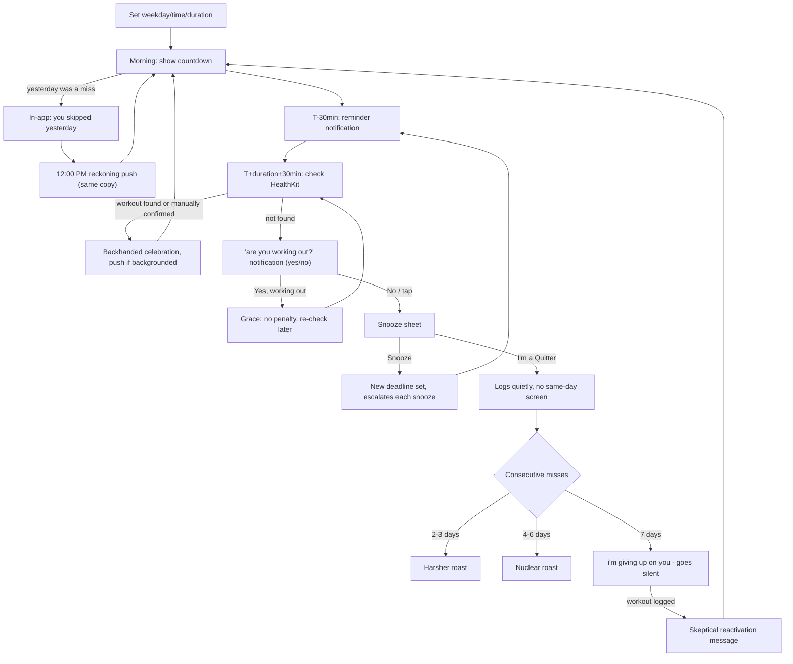

todos:
  - id: phase0-scaffold
    content: "Phase 0: BROiled SwiftUI iOS 17 project at ~/Projects/broiled, SwiftData models (Habit, DayLog, UserSettings), single-habit schedule setup (weekday × time × duration)"
    status: in_progress
  - id: phase0-healthkit
    content: "Phase 0: HealthKitService - deadline query (any source), manual 'I've locked in today' fallback button"
    status: pending
  - id: phase0-scheduler
    content: "Phase 0: deadline notification, 12:00 PM reckoning push, uncapped escalating snooze, morning reckoning message, backhanded-celebration success state"
    status: pending
  - id: phase0-insults
    content: "Phase 0: static curated insult list (~40 lines, mild/spicy/nuclear tagged, no persona system yet), plain in-app miss/success screens"
    status: pending
  - id: phase0-streaks
    content: "Phase 0: miss-streak escalation ladder (2-3 / 4-6 / 7-day) and the silence + reactivation mechanic"
    status: pending
  - id: phase1-persona
    content: "Phase 1: named persona + voice (incl. non-bro options), Insults.json namespaced by persona × intensity, polished full-screen ShameView, Live Activity/Dynamic Island countdown"
    status: pending
  - id: phase1-schedule-gen
    content: "Phase 1: auto-generate weekly schedule from a frequency goal (e.g. 3x/week), user-adjustable"
    status: pending
  - id: phase1-weekly
    content: "Phase 1: WeeklyReportBuilder + Sunday notification + shareable card"
    status: pending
  - id: phase2-ai-photo
    content: "Phase 2: opt-in AI 'consequence photo' via Cloudflare Worker/Replicate proxy, weekly cache"
    status: pending
  - id: phase2-hall-of-shame
    content: "Phase 2: Hall of Shame history screen + share cards for ShameView/streak milestones"
    status: pending
  - id: testflight
    content: "BROiled branding (icon, wordmark with BRO emphasis), onboarding disclaimers, 17+ tone, device testing, TestFlight build"
    status: pending
isProject: false
---

# BROiled (iOS)

## Branding (locked)

| Slot | Copy |
|------|------|
| **App name** | BROiled |
| **App Store subtitle** (≤30 chars) | `BROke your commitment = cooked` (30 chars) |
| **Marketing tagline** | BROke your workout commitment? You're cooked. |

**Pun stack:** **BRO**iled (name) + **BRO**ke (subtitle) + **cooked** (broiled/roasted payoff). Reframed from "streak" to "commitment" - the point isn't that a counter reset, it's that you didn't keep your word to yourself, which is the sharper and more personal thing to get roasted for.

**Wordmark:** emphasize **BRO** in both BROiled and BROke; `iled` / streak line can be lighter or flame-toned.

**Project path:** [`/Users/quinnnguyen/Projects/broiled`](/Users/quinnnguyen/Projects/broiled)  
**Bundle ID:** `com.quinnnguyen.broiled` (adjust to your Apple Developer team prefix)

**Inclusivity note:** Phase 0 ships with Gen-Z food-slang lexicon ("cooked," "mid," "ate," "washed," "toast") which is gender-neutral, platform-wide slang, not gym-bro-specific - this resolves the name's bro-coded first read. Phase 1 adds additional persona voices (savage best friend, disappointed coach, tough-love parent) as options beyond the meme voice.

---

## Why this is fun (not just mean)

A shame notification by itself is just a scold - annoying, not delightful. What makes this fun to actually use is the game loop wrapped around the insults, not the insults themselves:

- **Dread → relief is the core dopamine loop.** The countdown to deadline is real stakes, like a boss timer. Log the workout and the pending shame silently clears - that's a small win you get to feel *every day you succeed*, not just punishment on the days you fail.
- **A character, not a random-insult generator.** CARROT Fit (2014, still on the App Store, 4.7★) proved this genre works for a decade on one insight: people don't get attached to "insult #47," they get attached to a personality with a consistent voice. Phase 0 ships with a static curated list; Phase 1 gives it a name and a real voice - see `phase1-persona`.
- **The silence is scarier than the noise.** The 7-day "I'm giving up on you" mechanic - the app going completely quiet until you prove yourself - is the sharpest hook in this design. Most apps nag harder when ignored; this one does the opposite, and making the user *earn back* the app's attention is a stronger emotional beat than any single insult.
- **Backhanded celebration closes the loop.** Success isn't met with silence or a green checkmark, it's met with grudging, sarcastic approval ("you're not a loser today" / "you're not a dud today"). That's what makes the whole thing feel like a relationship with a character instead of a checklist.
- **Design for screenshots eventually.** Not in Phase 0, but the weekly report and Hall of Shame (Phase 1/2) should be built to be shared - that's the real growth channel for a niche comedy app, not App Store search.

## The core motivation

There's a mentality people describe as having "a bit of dog in you" - the extra gear that shows up when something's actually on the line, the refusal to take a soft no from yourself. Most people don't have easy access to that gear on a random Tuesday when the only thing at stake is whether they go to the gym. This app manufactures that gear on demand - it's the stand-in for stakes that aren't naturally there.

And underneath that: at some point you move out, and the one voice that never once said "good enough" goes quiet. Nobody's tracking your effort against your potential anymore. Nobody's unimpressed on your behalf. This app is built to be that voice again, on purpose - the parent who steps back in for the one thing you keep meaning to actually stick to, because you're the one who asked it to.

It's not therapy and it doesn't pretend to be encouraging. It's a rival and a disappointed relative who happen to live in your lock screen, and the entire game is proving them wrong.

**Why gen-z slang carries the roast:** that same energy can be delivered two ways, and the voice matters as much as the mechanic. A blunt "you're the bottom 20%" reads as a real insult - it lands as mean, not funny, especially for an audience that's grown up more sensitive to being talked down to (the "strawberry generation" bit isn't wrong, it's just not something to fight, it's something to design around). Kitchen slang ("cooked," "mid," "toast") keeps the exact same bite - the roast still stings, the silence mechanic still works, missing a day still feels bad - but it reads as a bit being run on you, not a verdict on you. That's the difference between a line you screenshot and send to a friend laughing, and one you just feel bad about. Lighter delivery, same teeth.

---

## Build phases

| Phase | Scope |
|-------|-------|
| **Phase 0 (true MVP - build this first)** | One habit ("Workout"), manual weekday × time × duration setup, HealthKit deadline check + manual fallback, uncapped escalating snooze, morning reckoning message, backhanded celebration, miss-streak ladder + silence/reactivation mechanic, static ~40-line insult list. No persona system, no Live Activity, no auto-schedule, no weekly report, no AI photo. |
| **Phase 1** | Named persona + voice (`Insults.json` namespaced by persona × intensity), polished full-screen roast UI, Live Activity/Dynamic Island countdown (real ActivityKit work - needs a widget extension), auto-generated weekly schedule from a frequency goal, weekly roast report + shareable card |
| **Phase 2** | Opt-in AI "consequence photo," Hall of Shame history screen, share cards for roast moments and streak milestones, multiple persona packs |
| **Phase 3 (deferred)** | Friend shame SMS (Twilio, double opt-in), app blocking via `FamilyControls` (requires Apple entitlement approval, 2-4 week lead time - submit early if you get here) |

Phase 0 is intentionally small enough to build in days and use on your own phone before touching TestFlight. Everything that makes the app *feel* like a finished product - the persona, the countdown widget, the shareability - is Phase 1+, deliberately deferred so the core loop can be validated first.

---

## Core user loop (Phase 0)



**Notification schedule (Phase 0):**
1. **12:00 PM (day after a miss)** - morning reckoning push: "you skipped yesterday" / "is this who you are, or can you be better today?" - same copy as the in-app banner (frame 03). Only fires if yesterday was missed. Tapping opens home with reckoning + today's countdown. Suppressed if the user already opened the app and saw the reckoning banner today.
2. **T-30min before deadline** - reminder push ("30 minutes left today") with the taunt "still time to lock in and complete" so the deadline doesn't arrive as a surprise. Tapping opens the snooze sheet directly, since that's the only decision left to make at that point.
3. **T + workout duration + 30min after deadline** - this is the actual miss check, not the deadline itself, since HealthKit needs time for a just-started workout to land even if the user heads out right at the deadline. **It asks, it doesn't accuse:** the notification is an interactive "are you working out right now?" / "tap yes if you're mid-session, chef" with two actions - **"yes, i'm working out 💪"** and **"no"**. A flat "you didn't work out" is unfair when a workout started near the deadline can still be running when the check fires. **Yes** gives grace (no penalty) and re-arms the check for roughly one more workout's worth of time so HealthKit can log the finished session; **No** (or a plain tap) opens the snooze sheet. Copy scales with streak on the morning reckoning, but the miss-check question itself stays neutral by design.
4. **On success** - if HealthKit picks up the workout while the app is backgrounded, the backhanded-celebration line fires as a push ("you're not a loser today" or "you're not a dud today" / "let's see about tomorrow"). If the user is already in-app and taps "I've locked in today," it just shows inline (no notification needed, they're already looking at it).

**Snooze contract:** uncapped, not a fixed 2/day limit. The snooze sheet itself doesn't show an insult - the mini-insult arrives later, in the next miss-check notification (see schedule above), and escalates per snooze count that day: **snooze 1 → MILD pool, snoozes 2–3 → SPICY pool, snooze 4+ → NUCLEAR pool**, cycling once exhausted. Snoozing re-arms the T-30min/T+duration+30min notification pair against the new deadline.

**Morning reckoning, not same-day failure:** if yesterday's deadline was missed (i.e., "I'm a Quitter" was tapped, or the day ran out with no response), the *next morning* delivers the reckoning two ways: a **12:00 PM push** (same copy as frame 03) and an **in-app banner on first open** ("you skipped yesterday" + "is this who you are, or can you be better today?"), then today's countdown underneath. No full-screen shame mid-day when the user can't do anything about it yet - the reckoning is deliberately delayed to the next calendar day. If they already opened the app and saw the banner, skip the noon push.

**Silence mechanic:** after a 7-day miss streak, the app fires one final "i'm giving up on you" / "no room for chopped losers here, talk to me when you're worth it" line and then **stops notifying entirely** - no countdowns, no morning messages, no reminders - until a workout is logged, which triggers a skeptical reactivation message and resumes normal operation.

---

## Verification model

Default to reading HealthKit, with a manual fallback - no geofencing, no source-filtering games. If people self-report a workout that didn't happen, they're only lying to themselves; Strava allows manual entries for the same reason, and the psychological pressure in this app comes from the escalation/silence design, not from surveillance rigor.

- **Primary:** query HealthKit for a workout meeting `minDuration` on the current day. This covers Apple Watch, Garmin (via Garmin Connect's Health sync), Strava, Peloton, gym equipment with Bluetooth, or anything else that writes an `HKWorkout` - no device requirement, no app-specific integration needed.
- **Fallback:** if nothing's found by the deadline, a manual "I've locked in today" button in-app satisfies the day - but tapping it surfaces one gut-check before it counts: *"this app is private, lying to it is embarrassing. did you work out today?"* with **"yes!"** / **"...no I lied"**. This isn't a real gate (there's no way to verify a manual claim regardless), it's a beat that makes the user say the lie out loud to themselves if they're going to tell it - which fits the theme better than pretending the button is bulletproof. "yes!" logs success normally; "...no I lied" just returns to the countdown, nothing logged.

This also fixes a real market-sizing risk: requiring an Apple Watch specifically would exclude most of the target audience (only ~50% of US adults own any tracker, and Watch-specific figures are murkier), and the people who most need this app are disproportionately *less* likely to already have a disciplined tracking habit. Defaulting to HealthKit-with-fallback keeps the addressable market at "anyone who wants to work out," not "anyone who already owns a wearable."

---

## Insult pool (Phase 0 - Gen-Z meme voice)

Organized by use-case slot with severity tags (MILD / SPICY / NUCLEAR) so Phase 0's snooze escalation works without mechanical changes. Primary lexicon is food/cooking metaphor tied to the BROiled brand ("cooked," "mid," "ate," "washed," "toast," "fried," "chef," "kitchen"), with a second glow-up/aura register for success moments and a bank of non-food gen-z slang ("audacity," "npc," "take the L," "skill issue") mixed in wherever it lands better than forcing a food pun. Deliberately avoids current trend-slang with a short shelf life (rizz, skibidi, gyat) in favor of terms with more staying power.

All lines lowercase with minimal punctuation (no trailing periods, question marks dropped, a bare "-" for a beat instead of an em dash) - matches the copy in `wireframe_phase0.html`. When the reckoning headline is always "you skipped yesterday," sublines must not repeat "yesterday" (e.g. "mid, no notes" not "yesterday - mid, no notes").

**Zero-streak start (Day 0 / first log)**
- "kitchen's open, prove it" - MILD
- "day 1 - no crumbs yet, good or bad we'll see" - MILD
- "prep's done, cook time" - MILD
- "nobody's roasted you yet, rare mercy" - MILD

**Onboarding**
- "when are you working out?" (screen headline)
- "set your schedule then prove it"

**Pre-deadline reminder (T-30min)**
- "still time to lock in and complete" - MILD (wireframe default)
- "timer's running, get cooking" - MILD
- "breakfast time - are you toasting or toast" - MILD (morning-slot variant)
- "lunch time, crunch time" - MILD (midday-slot variant)
- "winner winner or are you the chicken dinner" - MILD (evening/dinner-slot variant only - the punchline needs "dinner" to land)
- "fire work today" - MILD
- "your body's gonna be tea" - MILD

**Miss check @ deadline**
- "will you later?" - MILD (wireframe default)
- "you snooze you lose" - MILD (doubles as the transition line into the snooze sheet)
- "did ya fold" - MILD
- "did you clock out" - MILD
- "no extensions" - MILD
- "is it a skill issue" - MILD
- "burned before you even started" - MILD
- "the audacity to not show up" - SPICY
- "npc behavior" - MILD
- "take the l" - MILD

**Miss check, snooze 1 (MILD)**
- "still marinating"
- "don't let it burn"
- "don't make me come back"
- "bro really said 5 more minutes"
- "bro hit snooze"
- "don't make me roast you later"

**Miss check, snooze 2-3 (SPICY)**
- "you're a recipe for disaster"
- "fire the chef, you're taking the burn today"
- "half baked and proud of it apparently"
- "low-key embarrassing at this point"
- "this you - third time's not the charm"
- "simmer down - oh wait you already have"

**Miss check, snooze 4+ (NUCLEAR)**
- "fried chicken's probably the healthiest thing you ate today"
- "toast"
- "folded"
- "fumbled"
- "ash"

*Not a must-have for Phase 0, but worth a Phase 1 note: consider a deterministic word ladder keyed to snooze count (raw → simmering → burning → fried → toast → ash) instead of a random pool, so the escalation feels structured rather than angrier-random.*

**Morning reckoning (day after miss)**
- "is this who you are, or can you be better today?" - MILD (wireframe canonical subline; headline is always "you skipped yesterday")
- "mid, no notes" - MILD (pool alternate - no "yesterday" repeat)
- "leftovers went bad" - MILD (pool alternate)
- "that workout ghosted itself" - SPICY

**Streak 2-3 consecutive misses**
- "this ain't a phase this is the plot" - SPICY
- "you're speedrunning washed" - SPICY
- "three days of vibes zero days of reps" - SPICY

**Streak 4-6 consecutive misses**
- "at this point i'm not disappointed i'm just not surprised" - SPICY (wireframe canonical)
- "bro really said let it rot" - SPICY (pool alternate)
- "you're down bad" - NUCLEAR

**7-day miss finale (then silence)**
- "i'm giving up on you" / "no room for chopped losers here, talk to me when you're worth it" - NUCLEAR
- Then literal silence - no push copy at all until a workout is logged.

**Reactivation (after silence break)**
- "redemption arc or fluke, we'll see" - MILD
- "you a comeback king or is this just another fling" - MILD
- "character development" - MILD

**Backhanded celebration (success day)**
- "you're not a loser today" - MILD (wireframe canonical; pick interchangeably with dud variant)
- "you're not a dud today" - MILD
- "let's see about tomorrow" - MILD (canonical subline)
- "you ate - barely" - MILD (pool alternate)
- "certified chef - for today" - MILD
- "rare w, emphasis on rare" - MILD
- "showed up to glow up" - MILD
- "aura +100 allegedly" - MILD
- "certified banger - for today" - MILD
- "slay but let's not get ahead of ourselves" - MILD
- "understood the assignment - barely" - MILD

**Rare/easter-egg line (very high streak, e.g. 100+ days)**
- "too hot to roast" - reserved, not part of the regular rotation; the roast persona genuinely runs out of material, a narrative beat rather than a stock line.

**Manual-fallback gut-check**
- Prompt: "this app is private, lying to it is embarrassing" / "did you work out today?"
- Yes button: "yes!"
- No button: "...no I lied"

**Milestone rank titles (success-streak ladder, locked)**
- **1 day:** fresh meat, not roasted yet
- **7 days:** you ate
- **14 days:** left no crumbs
- **30 days:** main character energy
- **100 days:** it's canon now
- **365 days:** final boss unlocked

**Content note:** as with the original pool, avoid lines that exploit real disability/illness - keep the focus on food/cooking metaphor, glow-up/aura framing, and self-directed callout slang, not punching down at others' hardship. Also avoid gendered variants of the glow-up lines (e.g. "you're that girl") to preserve the gender-neutral framing.

---

## Data model (SwiftData) - Phase 0

```swift
@Model class Habit {
  var name: String = "Workout"
  var minDurationMinutes: Int
  var deadlinesByWeekday: [Int: DateComponents] // 1=Sun...7=Sat, each active day has its own hour/minute
}

@Model class DayLog {
  var date: Date
  var status: DayStatus // completed | missed | pending
  var verifiedByHealthKit: Bool
  var snoozeCount: Int // uncapped
  var insultShown: String?
}

@Model class UserSettings {
  var missStreak: Int
  var successStreak: Int // consecutive success days; resets to 0 on miss; drives rank titles
  var isAbandoned: Bool // true after 7-day miss streak, suppresses all notifications until reactivated
  
  // Computed rank title from success-streak (not stored, generated on read)
  var rankTitle: String {
    switch successStreak {
      case 1: return "fresh meat, not roasted yet"
      case 7: return "you ate"
      case 14: return "left no crumbs"
      case 30: return "main character energy"
      case 100..<365: return "it's canon now"
      case 365...: return "final boss unlocked"
      default: return successStreak > 0 ? "Cooking" : "Unranked"
    }
  }
}
```

Phase 0 also adds a success-streak counter and a computed rankTitle property (fresh meat → final boss ladder) to drive the milestone badge UI. Phase 1 adds `Persona`/`voice` to `UserSettings` so users can pick between meme/tough-love/etc. and namespaces insults by persona + intensity; Phase 2 adds `selfieAssetId`/`imageApiEnabled`.

---

## Phase 0 screens

1. **Onboarding - Set your schedule** - headline "when are you working out?"; pick active weekdays, then set a deadline time **per active day** (not one shared time), plus minimum workout duration; HealthKit permission requested once, first run only
2. **Home - Countdown (on track)** - today's countdown to deadline, current rank title displayed above or beside countdown, manual "I've locked in today" button
3. **Home - Morning reckoning** - shown first if yesterday was a miss: "you skipped yesterday" + "is this who you are, or can you be better today?", then today's countdown with rank title
4. **Notification - Morning reckoning (12:00 PM)** - lock-screen push the day after a miss; same copy as frame 03. Tapping opens home with banner + countdown. Skipped if user already saw in-app reckoning today.
5. **Gut-check sheet** - shown on tapping "I've locked in today": "this app is private, lying to it is embarrassing" / "did you work out today?" / **yes!** / **...no I lied**
6. **Notification - T-30min reminder** - lock-screen banner ("30 minutes left today" / "still time to lock in and complete"), taps into the snooze sheet
7. **Notification - miss check** - interactive lock-screen banner asking "are you working out right now?" with **yes, i'm working out 💪** / **no** actions. Yes = grace + later re-check; No (or plain tap) opens the snooze sheet
8. **Snooze sheet** - title "push it back?"; pick a new deadline time; buttons are **Snooze** / **I'm a Quitter**
9. **Notification - success** - lock-screen banner ("you're not a loser today" or "you're not a dud today" / "let's see about tomorrow"), fires when HealthKit catches the workout in the background
10. **Home - Success (backhanded celebration)** - in-app version: same copy as frame 09/10a, with rank title displayed
11. **Home - Silence state** - after a 7-day miss streak: "i'm giving up on you" / "no room for chopped losers here, talk to me when you're worth it", no countdown, single "log a workout" action to reactivate
12. **Settings** - edit schedule (per-day times), HealthKit permission status. No data-deletion option in Phase 0 - not needed yet.

---

## Competitive landscape

Two genuinely different genres are relevant here - worth being deliberate about which one you're borrowing from and which you're avoiding.

**Comedic/insult accountability (closest ancestor):**

| App | What it does | Gap this app can exploit |
|-----|---------------|---------------------------|
| **[CARROT Fit](https://apps.apple.com/us/app/carrot-fit/id769155678)** (2014) | Sarcastic single-persona AI, manual weigh-ins + HealthKit sync, chat-bubble UI, threatens/insults/bribes | Last updated 4+ years ago, dated UI, fully manual data entry, no deadline-driven real-time escalation, no shareable content designed for social, single fixed persona, no "give up on you" mechanic |
| **[Roast My Fit](https://play.google.com/store/apps/details?id=app.roastmyfit.ai)** (fashion, not fitness) | AI roasts your outfit photo at adjustable intensity, generates shareable branded roast cards for IG/TikTok | Proves the *content format* (shareable AI roast + intensity slider) has App Store/social traction right now - validates the share-card instinct for Phase 1/2, but it's not tied to real behavior/accountability at all |

**Financial commitment devices (different lever, same thesis - "consequences drive behavior"):**

| App | Mechanism | Contrast |
|-----|-----------|----------|
| **[Beeminder](https://www.beeminder.com/overview)** | Auto-tracks via 30+ integrations (incl. Apple Health), escalating cash pledges ($5 → $7,290) on a graphed "road" | Deep automation like this app's HealthKit checks, but the penalty is money + data visualization, not humiliation |
| **StickK** | Free, self-reported, money to charity/anti-charity, human referee | No automated verification - relies on honesty, same fallback philosophy this app uses but without any automatic layer at all |
| **HealthyWage / DietBet / StepBet** | Bet real money on weight loss or step goals, forfeit on failure | Financial stakes, not comedic - different psychographic |
| **[Fitness Pact](https://apps.apple.com/us/app/fitness-pact-better-together/id1667620204)** | Friend-defined custom punishment + reminder notifications | Closest existing analog to this app's deferred Phase 3 friend-SMS feature |

**Net differentiation:** the unique bundle is *HealthKit-first verification with an honest fallback* (broader reach than CARROT's fully-manual model or a Watch-only gate) + *escalating consequence design culminating in silence* (nobody else does this - most apps nag harder when ignored, this one goes quiet) + *comedic persona* (not financial stakes) + *built for share-culture virality* (Phase 1/2). Staying thematically in CARROT's lane while modernizing the automation, escalation, and shareability is the right call - don't chase the financial-stakes genre, it's a different audience and adds regulatory complexity.

## Mass-market appeal: realistic read

This is a **durable niche/cult product, not a mass-market fitness app** - and that's fine, it doesn't need to be MyFitnessPal to be worth building.

- **The audience self-selects.** People download this *because* they already know they respond better to being roasted than to a green checkmark. CARROT sustained a business on this segment for over a decade, but it's inherently smaller than general fitness-tracking.
- **17+ tone caps App Store editorial upside.** Assume zero organic editorial placement from Apple; plan growth around word-of-mouth and social sharing instead.
- **Verification design keeps the market from narrowing further.** Defaulting to HealthKit-with-manual-fallback (rather than requiring a Watch) means the addressable market is "anyone who wants to work out," not "people who already own a $400 wearable" - a real fix from an earlier draft of this plan that would have gated adoption behind device ownership.
- **The content is more mass-market than the app.** A screenshot of a brutal AI roast is inherently more shareable/memeable than the app itself is installable - Roast My Fit's traction is the proof point. Lean into that as the primary growth channel (Phase 1/2 share cards), not App Store search - there's no real search-term demand for this concept.
- **Realistic ceiling:** a profitable, sustained niche app with a loyal following and decent App Store category presence (Health & Fitness charts, not top-100 overall) - think CARROT's trajectory, not a venture-scale outcome. A low one-time price or light subscription (persona packs, extra AI generations, Phase 1+) fits better than a heavy monetization/growth-funded model.

## Further refinement suggestions

1. **Persona identity is Phase 1, not Phase 0** - namespace `Insults.json` by persona once it's built, since retrofitting a second voice into a single hardcoded pool later means rewriting content, not just adding a dimension.
2. **Let users pick their tormentor's personality at Phase 1 onboarding**, not just a mild/spicy/nuclear slider - include voices beyond gym-bro (savage best friend, disappointed coach, etc.) so BROiled doesn't read as men-only; different personas landing differently on different people is a bigger retention lever than intensity alone, and it's natural IAP content later.
3. **Hall of Shame (Phase 2) should be a real screen**, not just a report - gives users a reason to open the app on good days too.
4. **AI "fatter you" photo (Phase 2) should be opt-in by default, not opt-out** - given App Store review sensitivity and legitimate body-image concerns already documented around AI weight-visualization tools.
5. **Instrument share/screenshot attribution from day one of Phase 1** - if social virality is the real growth channel, track which roast lines/images actually get shared, not just DAU/streak metrics.
6. **Consider an optional "raise the stakes" tier later** (Phase 3+) that borrows the financial-commitment mechanic (small real money, à la StickK) for users who've outgrown pure insults.
7. **Write more NUCLEAR-tier insults before ship** - the pool above has ~9, which will repeat noticeably at snooze 3+ or the 7-day finale.

---

## App Store / risk notes

- **17+** recommended (crude humor)
- Clear opt-in to insult tone; no harassment of third parties
- AI body image (Phase 2): satire disclaimer, opt-in by default, not eating-disorder targeting
- HealthKit: only claim "checks whether a workout was logged," not medical advice

---

## Deferred: friend SMS (Phase 3)

Requires:
- Twilio (or similar) backend - iOS cannot auto-send SMS without user interaction per message
- Friend **opt-in link** ("Quinn added you as accountability partner - reply YES to confirm")
- Escalation only after N failures + user pre-consent
- Kill switch in Settings

Do not build until the Phase 0 core loop feels good in daily use.

---

## Deferred: app blocking (Phase 3)

Use `FamilyControls` + `ManagedSettings` + `DeviceActivity` extension target.

Block selected apps until habit satisfied for the day. Requires [Apple Family Controls distribution approval](https://developer.apple.com/contact/request/family-controls-distribution) per bundle ID - plan 2–4 weeks lead time. Submit entitlement request early when you start this phase, in parallel with coding.

---

## Reference: Phase 1 persona planning

**See:** `broiled-phase-1-persona-tough-love.plan.md` for the original tough-love voice and motivation framework, reserved for Phase 1 when the persona system is built. That doc contains the full insult pool and core motivation behind the "disappointed parent/rival" angle - useful for designing additional personas (Disappointed Coach, Savage Best Friend, etc.) that use the same escalation mechanics but different emotional drivers.

---

## v0.2 update plan (post daily-use feedback)

Driven by real on-device usage of the Phase 0 build. Organized in three waves; each item ships across all four surfaces (wireframe, prototype, iOS code, this plan) before moving on.

### Wave 1 - bugs, copy, daily frictions

1. **De-chef copy sweep.** Drop the chef-persona addressing ("chef", "fire the chef", "certified chef", "get cooking"-style user-as-cook lines); keep the food-*state* slang that is the brand payoff (cooked, toast, roast, ate, chopped, rare W). Full keep/cut table lives in the session notes; InsultPool.swift is the source of truth, wireframes/prototype sync to it.
2. **Snooze redesign.** Real time picker (any time later today) replaces the fixed +15/+30/+1h/+3h options. New distinct option: **push to tomorrow** - allowed with an extra insult if tomorrow is a rest day; if tomorrow is already a scheduled day, warn that snoozing to tomorrow does not merge workouts and **today becomes a miss** (confirmed decision), then route through the normal quit path.
3. **Fix the success push.** `fireSuccessPush()` exists but is never called (root cause of the "notification 09 never showed" bug), and nothing detects workouts while backgrounded. Fix: wire it into the success path AND add HealthKit background delivery (`HKObserverQuery` + `enableBackgroundDelivery`) so a workout that syncs while backgrounded fires the success push, cancels the pending miss-check, and settles the day. Milestone days (1/7/14/30/100/365) use their rank-ladder line as the push copy instead of the generic one.
4. **Notifications-denied guard.** If notification permission is denied, the entire consequence engine silently dies. Persistent in-app warning banner + deep link to system Settings.

### Wave 2 - richer notifications, workout types, rest days

5. **Rich notifications (Notification Content Extension).** Big expanded layout with large action buttons (iOS constraint: collapsed banners cannot show buttons; actions appear on long-press/expand - the extension makes the expanded state big and custom).
   - **Frame 06 (T-30min reminder):** actions = "Snooze" (opens app to snooze sheet) + "I'm heading out" (dismisses).
   - **Frame 07 (miss check):** actions = "I'm working out 💪" (grace + later re-check, mechanic already built) + "Snooze" (opens app to snooze sheet) - replaces the yes/no pair.
6. **Workout types.** New `WorkoutEntry` model (date, type, source healthKit/manual, duration, note) supporting **multiple workouts per day**; `DayLog` still owns the day's status. Schedule gains optional per-day workout type (Apple-Fitness-style picker + free text); notifications become "30 min till <type>"; HealthKit-detected workouts show their real type.
7. **Rest-day flow + bonus workouts.** Fixes a real bug: Home currently renders a red 0:00 countdown on non-scheduled days (deadline falls back to `Date()`). Proper rest-day state with "log a bonus workout" (HealthKit-detected or manual). Bonus workouts are recorded in history but never advance the streak: "cute. bonus workouts don't buy back missed ones - no streak freezes here."
8. **Pause mode.** Settings gains a date-range pause: no notifications, no misses, streak frozen (not broken, not growing). Generic-guilt copy, not travel-specific: "paused. your muscles didn't get the memo, but fine." / resume: "break's over. hope you're not."

### Wave 3 - the Burn Book, Live Activity, widgets

9. **The Burn Book (collection/history page).** Chronological list of date + line received + type (roast/compliment). Unlock trackers: "X/N insults unlocked", "X/N compliments unlocked". Badge ladder where the badge names are themselves insults: 5 = "certified punching bag", 10 = "glutton for punishment", 25 = "roast magnet", 50 = "well done", all insults = "fully roasted"; compliments: 5 = "barely tolerable", 10 = "annoyingly consistent", all = "too hot to roast" (the reserved easter-egg line becomes the crown badge).
10. **Live Activity countdown** (lock screen + Dynamic Island). This is the answer to "persistent countdown banner" - a pinned notification is not possible on iOS and the Live Activity is the system-native, user-dismissible mechanism. Pulled forward from Phase 1.
11. **Home-screen widget** (streak + today's countdown) and a **best-streak stat**.

### Parked to Phase 2

- **User-generated insults**: once all insults/compliments are unlocked, users write their own for other people. Needs sharing + moderation infra; the unlock trackers ship in Wave 3 so the carrot is visible early.
- **Share cards for badge unlocks** ("I just unlocked 'glutton for punishment'") - the screenshot-bait growth loop, alongside the existing Phase 2 share-card plans.
